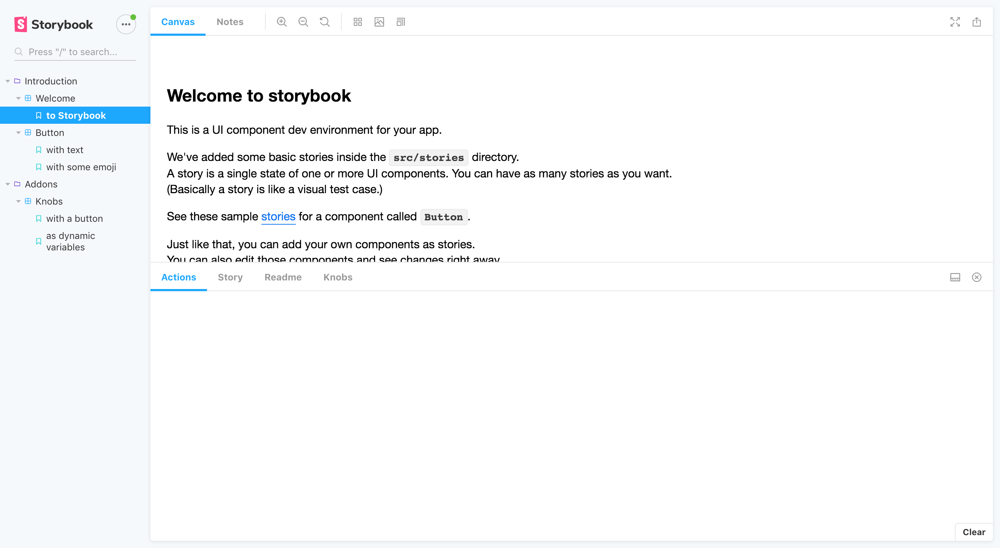
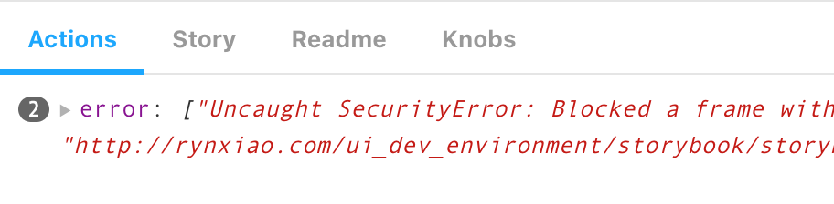
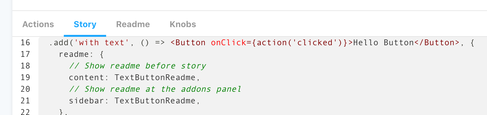
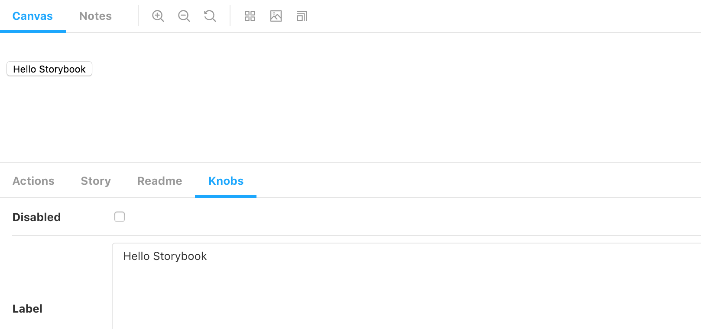
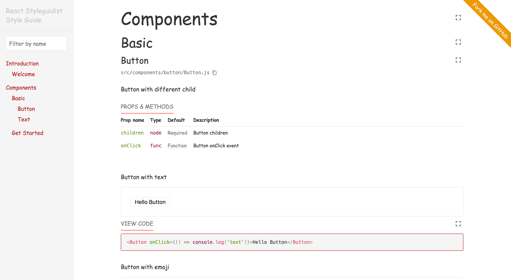
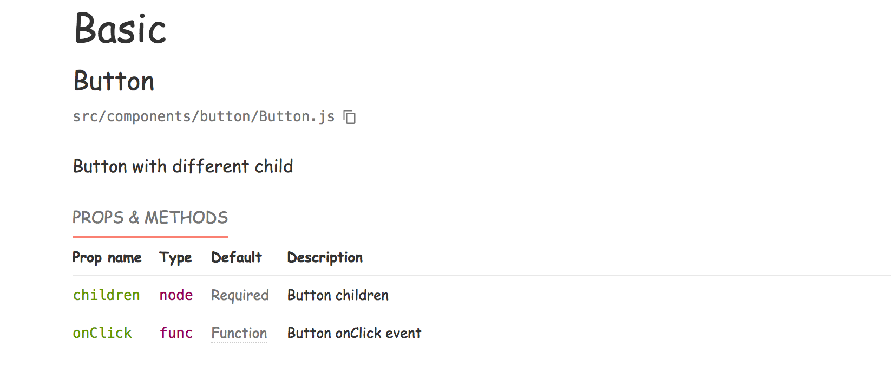
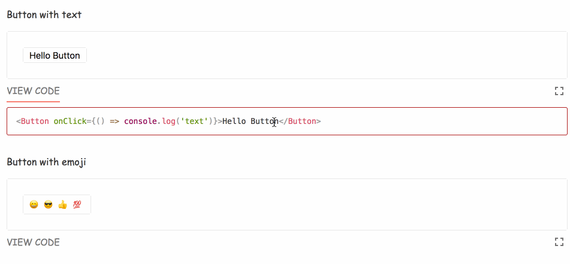

## UI开发环境

### 写在前面

由于本文主要集中关注与工具使用，所以不可能完全介绍工具的所有功能，所以要想了解更多，可以自己去各自官方网站上查看。

### 什么是UI开发环境

> UI开发环境专注于用户体验设计师与开发人员之间的协作（UI dev environments），为UI组件的快速迭代提供了综合环境。

通俗点来讲，目前主要应用于个项目中组件的测试、开发以及文档编写中，这样设计人员和开发人员可以通过组件预览的方式来指定设计规范。

目前可以使用的工具主要有：[Storybook](https://storybook.js.org/)、[React Styleguidist](https://react-styleguidist.js.org/)、[Compositor](https://compositor.io/)和[MDX](https://mdxjs.com/)。本文会重点介绍`storybook`以及`React Styleguidist`。

### 各工具之间的比较归纳

| Tools | React/Angular/Vue | 上手程度 | 主题自定义 | 附加功能(插件) | 测试环境 |
|:----|:----|:----:|:----|:----|:----|
| [Storybook](https://storybook.js.org/) | ✔️ / ✔️ / ✔️ | 中等 | 简便、颜色变化 | 丰富(源码/viewport/backgrounds...) | 提供了各种测试案例 |
| [React Styleguidist](https://react-styleguidist.js.org/) | ✔️ / X / X | 简单 | 简便、颜色结构变化 | 无 | [Enzyme](https://github.com/airbnb/enzyme)、[jest](https://jestjs.io/) |
| [Compositor](https://compositor.io/) | ✔️ / X / X | 简单 | 暂不支持 | 无 | [Enzyme](https://github.com/airbnb/enzyme)、[jest](https://jestjs.io/) |
| [MDX](https://mdxjs.com/) | ✔️ / X / ✔️(Beta) | 简单 | 简便、可以完全自定义 | 一般(remark/rehype  ) | [Enzyme](https://github.com/airbnb/enzyme)、[jest](https://jestjs.io/) |

### StoryBook

storybook的界面清新脱俗，至少个人认为还是比较好看的，像下面这样：



同时，storybook可以更换主题，具体可以戳[这里](https://storybook.js.org/docs/configurations/theming/)，更换的只是配色系统，结构方面改动的话可能有点困难。

storybook 可以支持多种语言，包括`react`,`vue`,`angular`...等主流前端库。

storybook中的一个重要概念就是`story`，翻译过来就是故事，不过可以通俗的理解为一个组件的一种状态。当然这个状态是你自己添加的，如果添加的故事越多，同时也就表明了你编写的组件复杂度就很高了，这时候你就可以考虑是否要拆分组件来使得组件的功能变得单一纯粹了，这样组件维护的成本才会变少，同时可用性也会更加高。

### 简单的入门

下面以一个`React`小项目来练手，如果对`Vue`以及`Angular`感兴趣的童鞋，可以去[官网](https://storybook.js.org/docs/basics/introduction/)了解一下，官方网站上有大量的例子以及新手教程。

#### Step 1: 创建一个项目名为`stroybook`, 同时创建`package.json`文件

```npm
mkdir stroybook
cd storybook
yarn init
```

填写你要初始化的信息，下一步。

#### Step2: 安装依赖

```npm
yarn add @storybook/react react react-dom babel-loader @babel/core --dev
```

#### Step3: 添加npm脚本

```json
{
"scripts": {
    "storybook": "start-storybook -p 6006",
    "build-storybook": "build-storybook",
    "serve": "yarn build-storybook && npx http-server ./storybook-static"
  }
}
```

- `storybook`: 运行这个脚本会起一个本地服务器，监听在6006端口
- `build-storybook`: 通过`webpack`进行打包，生成静态文件
- `serve`: 使用node服务运行静态文件

#### Step4: 创建配置文件，让storybook能够找到stories

```js
import { configure } from '@storybook/react';

// 手动添加所有stories
function loadStories() {
  require('../stories/index.js');
  // You can require as many stories as you need.
}

/**
* 或者匹配指定文件夹下的所有stories
*

function loadStories() {
  const req = require.context('../stories', true, /\.stories\.js$/);
  req.keys().forEach(filename => req(filename));
}

*/

configure(loadStories, module);
```

#### Step5: 编写组件故事

```js
import React from 'react';
import { storiesOf } from '@storybook/react';
import { Button } from '@storybook/react/demo';

storiesOf('Button', module)
  .add('with text', () => (
    <Button>Hello Button</Button>
  ))
  .add('with emoji', () => (
    <Button><span role="img" aria-label="so cool">😀 😎 👍 💯</span></Button>
  ));
```

#### Step6: Run

```npm
yarn storybook

// open browser
localhost:6006
```
你就可以看到文章上面的界面了。

### 组件测试

storybook在UI测试方面也提供了多种角度的测试方式：

- 内容结构测试：内容结构测试主要关注点在组件中的内容是否存在，比如内容是否包含`hello world`等字段，是否存在一个`button`等等
- 交互测试：交互测试主要是测试用户的点击、输入事件，会对结果造成的一个影响，比如点击了一个按钮之后，是不是会跳转到一个新的页面
- 视觉(样式)测试: 主要比较的是变更发生前和发生之后的`images`的变化，可能是像素级的
- 手动测试

#### 结构测试

在storybook中使用[jest's snapshot testing](https://facebook.github.io/jest/blog/2016/07/27/jest-14.html)作为组件的结构测试，使用的原理为：

比较变更之前的`html`结构和变更之后的`html`结构，如果不同，要么是现在的变更影响的，这时候我们只需要更新为最新的结构就可以了，反之就是出现了未知的错误造成的，就需要进行排查了。

使用storybook的结构测试也很简单，只需要两步配置即可：

- 安装依赖

```npm
yarn add --dev @storybook/addon-storyshots
```

- 在测试文件中初始化，例如`storyshots.test.js`

```js
import initStoryshots from '@storybook/addon-storyshots';

initStoryshots({ /* configuration options */ });
```

然后运行`yarn test`即可。

#### 交互测试

通常使用[Enzyme](https://github.com/airbnb/enzyme)来测试用户的输入以及点击事件。同时storybook也继承了相关的插件[Specs Addon](https://github.com/mthuret/storybook-addon-specifications)

这里就不多做演示了，详情可以戳上面的链接。

#### 自动化的视觉测试

视觉测试主要的优点就是一目了然，如果视觉测试能够做得非常容易，那么甚至可以取代一些比较脆弱的测试，比如判断是否有哪些`css`声明，`html`标签等等，如果视觉上看起来和变更前后保持一致，这些测试我们都是可以不关注的。

然而视觉测试最大的难点就是人类的对像素的感知度不同，机器相对人眼来说，可以识别的像素辨识度会高出许多，很多看上去相同的页面其实是发生了变化，但是人的肉眼可能看不出来而已。

关于视觉测试，有一些比较知名的库可以进行参考：

- [Applitools](https://applitools.com/storybook)
- [Chromatic](https://www.chromaticqa.com/)
- [Happo](https://happo.io/)
- [Loki](https://loki.js.org/)
- [Percy](https://docs.percy.io/docs/storybook-for-react)
- [Screener](https://screener.io/v2/docs)
- [StoryShots](https://github.com/storybookjs/storybook/tree/master/addons/storyshots) with its [seamless integration](https://github.com/storybookjs/storybook/tree/master/addons/storyshots#configure-storyshots-for-image-snapshots) with [jest-image-snapshot](https://github.com/americanexpress/jest-image-snapshot)

更多请参看[这里](https://storybook.js.org/docs/testing/react-ui-testing/)

### 强大的插件

storybook集成了许多优秀的插件，这些插件都是可以自由安装和卸载的，下面主要介绍几款实用的插件：

**注1**：storybook的绝大部分插件需要首先安装依赖，然后在`.storybook/addons`中进行注册，最后使用`.storybook/config`进行参数配置。当然也有例外，可以直接在`config`中进行引用，具体使用参看文档。

**注2**：storybook提供了很多有用的插件，这里就不一一列举的了，可以自己去[Addons](https://storybook.js.org/addons/)了解

- [console](https://github.com/storybookjs/storybook-addon-console)

通常我们使用`command + alt + I`(Mac)以及`F12`(Windows)打开`chrome`的控制台来查看打印的日志，而这个插件可以使我们不需要这么做，直接在`Actions`面板中就可以查看打印的日志，并且可以筛选出自己关心的日志，可以分为以下几步

```js
// install dependence
yarn add --dev @storybook/addon-console

// .storybook/config.js
import { setConsoleOptions } from '@storybook/addon-console';

setConsoleOptions({
  panelExclude: [],
});

// or write in story singly
// wrap your stories with specified addon options.
import { storiesOf } from '@storybook/react';
import { withConsole } from '@storybook/addon-console';

storiesOf('withConsole', module)
 .addDecorator((storyFn, context) => withConsole()(storyFn)(context))
 .add('with Log', () => <Button onClick={() => console.log('Data:', 1, 3, 4)}>Log Button</Button>)
 .add('with Warning', () => <Button onClick={() => console.warn('Data:', 1, 3, 4)}>Warn Button</Button>)
 .add('with Error', () => <Button onClick={() => console.error('Test Error')}>Error Button</Button>)
 .add('with Uncatched Error', () =>
   <Button onClick={() => console.log('Data:', T.buu.foo)}>Throw Button</Button>
 )
 // Action Logger Panel:
 // withConsole/with Log: ["Data:", 1, 3, 4]
 // withConsole/with Warning warn: ["Data:", 1, 3, 4]
 // withConsole/with Error error: ["Test Error"]
 // withConsole/with Uncatched Error error: ["Uncaught TypeError: Cannot read property 'foo' of undefined", "http://localhost:9009/static/preview.bundle.js", 51180, 42, Object]
```



- [source](https://github.com/storybookjs/storybook/tree/master/addons/storysource)

source插件主要会在工具栏面板中展示出我们当前所在的`story`源码



具体配置如下：

```npm
yarn add @storybook/addon-storysource --dev
```

然后在`addon`中注册

```js
import '@storybook/addon-storysource/register';
```

最后在`.storybook`中添加`webpack.config.js`，给每个`story`添加`decorator`

```js
module.exports = function({ config }) {
  config.module.rules.push({
    test: /\.stories\.jsx?$/,
    loaders: [require.resolve('@storybook/addon-storysource/loader')],
    enforce: 'pre',
  });

  return config;
};
```

- [knobs](https://github.com/storybookjs/storybook/tree/master/addons/knobs)

安装了knobs插件之后，可以在控制面板中编辑`React`组件中的`props`，同时knobs插件也会允许修改在story中编写的临时变量。

```npm
yarn add @storybook/addon-knobs --dev
```

```js
import '@storybook/addon-knobs/register';

import { storiesOf } from '@storybook/react';
import { withKnobs, text, boolean, number } from '@storybook/addon-knobs';

const stories = storiesOf('Storybook Knobs', module);

// Add the `withKnobs` decorator to add knobs support to your stories.
// You can also configure `withKnobs` as a global decorator.
stories.addDecorator(withKnobs);

// Knobs for React props
stories.add('with a button', () => (
  <button disabled={boolean('Disabled', false)} >
    {text('Label', 'Hello Storybook')}
  </button>
));
```



- [notes](https://github.com/storybookjs/storybook/tree/master/addons/notes)
- [backgrounds](https://github.com/storybookjs/storybook/tree/master/addons/backgrounds)
- [viewport](https://github.com/storybookjs/storybook/tree/master/addons/viewport)
- [spec](https://github.com/mthuret/storybook-addon-specifications)
- [react-live-edit](https://github.com/vertexbz/storybook-addon-react-live-edit)

### 写在最后

storybook作为一个组件开发工具来说，整体上手难度以及接入到已有项目中的成本并不是特别高。

同时对组件的预览、文档生成、测试以及功能编辑等等都提供了很好的支持，所以对于想类似于开发公共组件库的团队来说storybook是一个比较好的选择。

### React Styleguidist

> Isolated React component development environment with a living style guide

`React Styleguidist`提供了一个独立的`React`开发环境，能够通过简单的`Markdown`文档编写，就能定义出一份团队协作的文档指南。



总结下来，`React Styleguidist`有以下几个特点：

- 配置简单，只需要对`styleguide.config.js`简单的配置，就可以轻松构建本地服务器、配置全局样式、入口模板等等
- 编写文档比较简单，只需要通过编写`Markdown`就可以了
- 对第三方库支持广泛，[Redux](https://react-styleguidist.js.org/docs/thirdparties.html#redux) / [Styled-components
](https://react-styleguidist.js.org/docs/thirdparties.html#styled-components) / [CSS Modules with react-css-modules](https://react-styleguidist.js.org/docs/thirdparties.html#css-modules-with-react-css-modules) ...
- 实时代码编辑与预览
- 主题自定义
- 使用[Enzyme](https://github.com/airbnb/enzyme)和[jest](https://jestjs.io/)进行组件测试
- 不支持`Angular`/`Vue`

### 简单入门

下面主要针对完全手动的配置`Styleguidist`入手，如果你是通过`Create React App`脚手架起的`React`服务，你可以参照[官网](https://react-styleguidist.js.org/docs/getting-started.html)

- 安装`Styleguidist`

```shell
yarn add webpack react-styleguidist --dev
```

- 指定在`styleguide.config.js`中指定`component`的位置

```js
module.exports = {
  components: 'src/components/**/[A-Z]*.js'
}
```

当然，你也可以通过`sections`来自定义左侧菜单栏

```js
module.exports = {
  sections: [
      {
        name: 'Introduction',
        content: 'docs/get-started.md',
        components: 'src/introduction/Welcome.js',
        exampleMode: 'collapse', // 'hide' | 'collapse' | 'expand'
        usageMode: 'expand',
      },
      {
        name: 'Components',
        sections: [
          {
            name: "Basic",
            components: 'src/components/**/*.js',
            exampleMode: 'collapse',
            usageMode: 'expand',
          },
          {
            name: 'Get Started',
            external: true,
            href: 'https://react-styleguidist.js.org/docs/getting-started.html',
          },
        ],
      },
  ],
}
```

- 指定`Styleguidist`通过什么样的方式去加载你的组件

通过在`styleguide.config.js`中配置自定义的webpack配置，可以有以下几种方式：

```js
module.exports = {
  webpackConfig: require('./configs/webpack.js')
}

// 或者merge其他的配置
module.exports = {
  webpackConfig: Object.assign({}, require('./configs/webpack.js'), {
    /* Custom config options */
  })
}
```

自定义的webpack配置：

```js
module.exports = {
  webpackConfig: {
    module: {
      rules: [
        // Babel loader, will use your project’s babel.config.js
        {
          test: /\.jsx?$/,
          exclude: /node_modules/,
          loader: 'babel-loader'
        },
        // Other loaders that are needed for your components
        {
          test: /\.css$/,
          use: ['style-loader', 'css-loader']
        }
      ]
    }
  }
}
```

- 安装项目启动必须的依赖包

```shell
# loader
yarn add babel-loader style-loader css-loader --dev

# babel
yarn add @babel/core @babel/preset-env @babel/preset-react --dev

# react
yarn add core-js@2 react react-dom prop-types
```

- 添加`babel.config.js`

```js
module.exports = {
  presets: [
    [
      '@babel/env',
      {
        modules: false,
        useBuiltIns: 'usage',
      },
    ],
    '@babel/react',
  ],
};
```

- 添加浏览器支持(package.json)

```json
{
  "browserslist": [
      ">1%",
      "last 1 version",
      "Firefox ESR",
      "not dead"
    ]
}
```

- 添加运行脚本

```json
{
  
  "scripts": {
    "styleguide": "styleguidist server",
    "styleguide:build": "styleguidist build"
  }
}
```

或者直接在terminal中运行

```shell
npx styleguidist server
npx styleguidist build
```

### 组件注释编写文档

```jsx harmony
/** Button with different child */
const Button = ({ children, onClick }) => (
  <button onClick={onClick} style={styles} type="button">
    {children}
  </button>
);

Button.displayName = 'Button';
Button.propTypes = {
  /** Button children */
  children: PropTypes.node.isRequired,

  /** Button onClick event */
  onClick: PropTypes.func,
};
Button.defaultProps = {
  onClick: () => {},
};
```



通过代码与图片对比，一目了然，这里就不多介绍了

### `Markdown`进行组件预览以及在线编辑

`src/components/button/Buttom.md`

```markdown
Button with text

<Button onClick={() => console.log('text')}>Hello Button</Button>

Button with emoji

<Button onClick={() => console.log('emoji')}>
  <span role="img" aria-label="so cool">
    😀 😎 👍 💯
  </span>
</Button>

```



### [Configuration](https://react-styleguidist.js.org/docs/configuration.html)

配置方面太多，这里介绍怎么改变全局样式(styleguide.config.js)

```js
module.exports = {
  theme: {
      color: {
        link: 'firebrick',
        linkHover: 'salmon'
      },
      fontFamily: {
        base: '"Comic Sans MS", "Comic Sans", cursive'
      }
    },
    styles: {
      Logo: {
        // We're changing the LogoRenderer component
        logo: {
          // We're changing the rsg--logo-XX class name inside the component
          animation: 'blink ease-in-out 300ms infinite'
        },
        '@keyframes blink': {
          to: { opacity: 0 }
        }
      }
    },
}
```

添加`fork me`

```js
module.exports = {
  ribbon: {
    // Link to open on the ribbon click (required)
    url: 'https://github.com/Rynxiao/ui_dev_environment',
    // Text to show on the ribbon (optional)
    text: 'Fork me on GitHub'
  }
};
```

[styleguideComponents](https://react-styleguidist.js.org/docs/configuration.html#styleguidecomponents)

对style guide中的组件进行覆盖

```js
module.exports = {
  styleguideComponents: {
    Wrapper: path.join(__dirname, 'styleguide/components/Wrapper'),
    StyleGuideRenderer: path.join(
      __dirname,
      'styleguide/components/StyleGuide'
    )
  }
}
```

可以参看[customized style guide](https://github.com/styleguidist/react-styleguidist/tree/master/examples/customised)这个例子

### 写在最后

通过使用`styleguidist`，整体有以下几个感受：

- 编写十分简便，只需要通过添加注释以及编写markdown文档就能定义整个文档的规范
- 主题定制相对简单，而且各个页面中的组件都可以自定义，相当灵活
- 可以比较方便的集成第三方库
