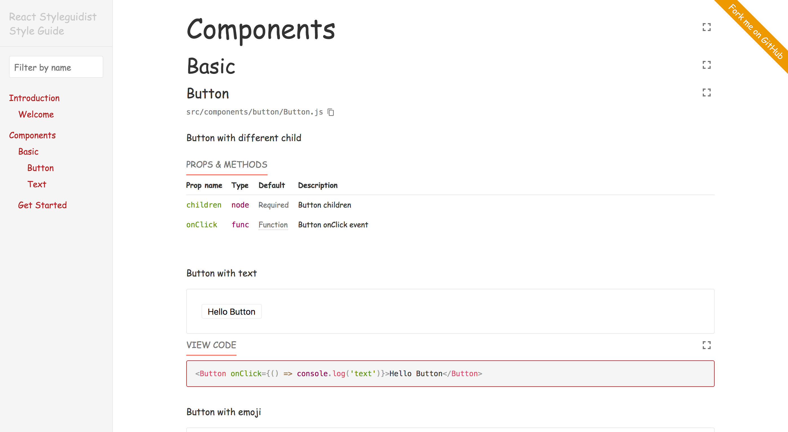
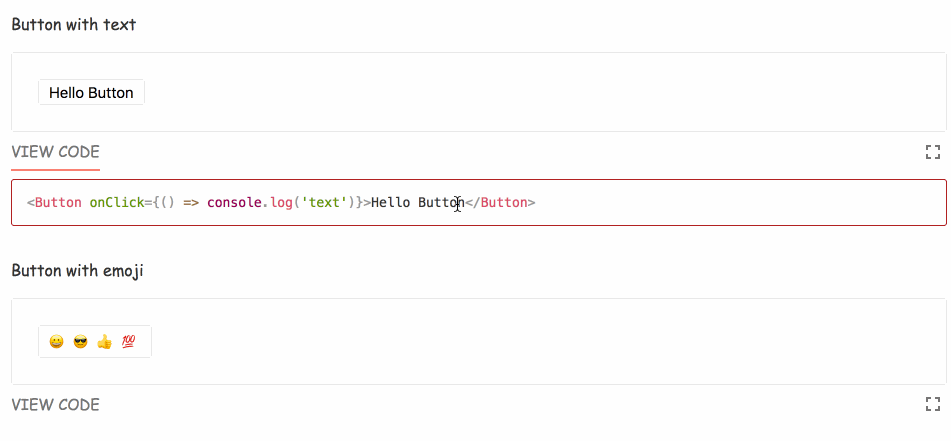

## React Styleguidist

> Isolated React component development environment with a living style guide

`React Styleguidist`提供了一个独立的`React`开发环境，能够通过简单的`Markdown`文档编写，就能定义出一份团队协作的文档指南。



总结下来，`React Styleguidist`有以下几个特点：

- 配置简单，只需要对`styleguide.config.js`简单的配置，就可以轻松构建本地服务器、配置全局样式、入口模板等等
- 编写文档比较简单，只需要通过编写`Markdown`就可以了
- 对第三方库支持广泛，[Redux](https://react-styleguidist.js.org/docs/thirdparties.html#redux) / [Styled-components
](https://react-styleguidist.js.org/docs/thirdparties.html#styled-components) / [CSS Modules with react-css-modules](https://react-styleguidist.js.org/docs/thirdparties.html#css-modules-with-react-css-modules) ...
- 实时代码编辑与预览
- 主题自定义
- 使用[Enzyme](https://github.com/airbnb/enzyme)和[jest](https://jestjs.io/)进行组件测试
- 不支持`Angular`/`Vue`

### 简单入门

下面主要针对完全手动的配置`Styleguidist`入手，如果你是通过`Create React App`脚手架起的`React`服务，你可以参照[官网](https://react-styleguidist.js.org/docs/getting-started.html)

- 安装`Styleguidist`

```shell
yarn add webpack react-styleguidist --dev
```

- 指定在`styleguide.config.js`中指定`component`的位置

```js
module.exports = {
  components: 'src/components/**/[A-Z]*.js'
}
```

当然，你也可以通过`sections`来自定义左侧菜单栏

```js
module.exports = {
  sections: [
      {
        name: 'Introduction',
        content: 'docs/get-started.md',
        components: 'src/introduction/Welcome.js',
        exampleMode: 'collapse', // 'hide' | 'collapse' | 'expand'
        usageMode: 'expand',
      },
      {
        name: 'Components',
        sections: [
          {
            name: "Basic",
            components: 'src/components/**/*.js',
            exampleMode: 'collapse',
            usageMode: 'expand',
          },
          {
            name: 'Get Started',
            external: true,
            href: 'https://react-styleguidist.js.org/docs/getting-started.html',
          },
        ],
      },
  ],
}
```

- 指定`Styleguidist`通过什么样的方式去加载你的组件

通过在`styleguide.config.js`中配置自定义的webpack配置，可以有以下几种方式：

```js
module.exports = {
  webpackConfig: require('./configs/webpack.js')
}

// 或者merge其他的配置
module.exports = {
  webpackConfig: Object.assign({}, require('./configs/webpack.js'), {
    /* Custom config options */
  })
}
```

自定义的webpack配置：

```js
module.exports = {
  webpackConfig: {
    module: {
      rules: [
        // Babel loader, will use your project’s babel.config.js
        {
          test: /\.jsx?$/,
          exclude: /node_modules/,
          loader: 'babel-loader'
        },
        // Other loaders that are needed for your components
        {
          test: /\.css$/,
          use: ['style-loader', 'css-loader']
        }
      ]
    }
  }
}
```

- 安装项目启动必须的依赖包

```shell
# loader
yarn add babel-loader style-loader css-loader --dev

# babel
yarn add @babel/core @babel/preset-env @babel/preset-react --dev

# react
yarn add core-js@2 react react-dom prop-types
```

- 添加`babel.config.js`

```js
module.exports = {
  presets: [
    [
      '@babel/env',
      {
        modules: false,
        useBuiltIns: 'usage',
      },
    ],
    '@babel/react',
  ],
};
```

- 添加浏览器支持(package.json)

```json
{
  "browserslist": [
      ">1%",
      "last 1 version",
      "Firefox ESR",
      "not dead"
    ]
}
```

- 添加运行脚本

```json
{
  
  "scripts": {
    "styleguide": "styleguidist server",
    "styleguide:build": "styleguidist build"
  }
}
```

或者直接在terminal中运行

```shell
npx styleguidist server
npx styleguidist build
```

### 组件注释编写文档

```jsx harmony
/** Button with different child */
const Button = ({ children, onClick }) => (
  <button onClick={onClick} style={styles} type="button">
    {children}
  </button>
);

Button.displayName = 'Button';
Button.propTypes = {
  /** Button children */
  children: PropTypes.node.isRequired,

  /** Button onClick event */
  onClick: PropTypes.func,
};
Button.defaultProps = {
  onClick: () => {},
};
```


通过代码与图片对比，一目了然，这里就不多介绍了

### `Markdown`进行组件预览以及在线编辑

`src/components/button/Buttom.md`

```markdown
Button with text

<Button onClick={() => console.log('text')}>Hello Button</Button>

Button with emoji

<Button onClick={() => console.log('emoji')}>
  <span role="img" aria-label="so cool">
    😀 😎 👍 💯
  </span>
</Button>

```



### [Configuration](https://react-styleguidist.js.org/docs/configuration.html)

配置方面太多，这里介绍怎么改变全局样式(styleguide.config.js)

```js
module.exports = {
  theme: {
      color: {
        link: 'firebrick',
        linkHover: 'salmon'
      },
      fontFamily: {
        base: '"Comic Sans MS", "Comic Sans", cursive'
      }
    },
    styles: {
      Logo: {
        // We're changing the LogoRenderer component
        logo: {
          // We're changing the rsg--logo-XX class name inside the component
          animation: 'blink ease-in-out 300ms infinite'
        },
        '@keyframes blink': {
          to: { opacity: 0 }
        }
      }
    },
}
```

添加`fork me`

```js
module.exports = {
  ribbon: {
    // Link to open on the ribbon click (required)
    url: 'https://github.com/Rynxiao/ui_dev_environment',
    // Text to show on the ribbon (optional)
    text: 'Fork me on GitHub'
  }
};
```

[styleguideComponents](https://react-styleguidist.js.org/docs/configuration.html#styleguidecomponents)

对style guide中的组件进行覆盖

```js
module.exports = {
  styleguideComponents: {
    Wrapper: path.join(__dirname, 'styleguide/components/Wrapper'),
    StyleGuideRenderer: path.join(
      __dirname,
      'styleguide/components/StyleGuide'
    )
  }
}
```

可以参看[customized style guide](https://github.com/styleguidist/react-styleguidist/tree/master/examples/customised)这个例子

### 写在最后

通过使用`styleguidist`，整体有以下几个感受：

- 编写十分简便，只需要通过添加注释以及编写markdown文档就能定义整个文档的规范
- 主题定制相对简单，而且各个页面中的组件都可以自定义，相当灵活
- 可以比较方便的集成第三方库


